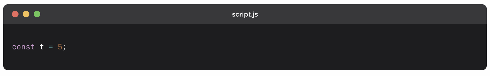
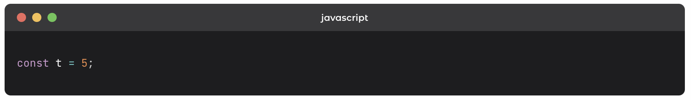
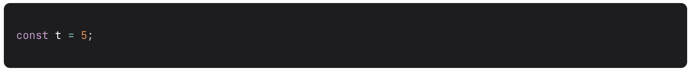

## Description

Add a header with mac like icons before each code snippet block. By default it adds the snippet's language as the title.

## Installation

```bash
npm install gatsby-remark-code-header
```

This plugin assumes that you are using [gatsby-transformer-remark](https://www.gatsbyjs.org/packages/gatsby-transformer-remark/).

## Global Options

`headerClassName`: The class name to use for the header. By default the class "gatsby-remark-code-header" is applied to the header.
`titleClassName`: The class name to use for the title. By default the class "gatsby-remark-code-title" is applied to the title.
`addExtensionTitle`: Defaults to `true`. Adds the language of the snippet as the title if no title is provided.
`showHeaderButtons`: Defaults to `true`. Shows mac-like buttons on the header.

## Inline Options

`Add {skipTitle} for snippets to be shown without titles.`
`Add {title: index.html}` to show "index.html" as the snippet title.

## Including the Plugin

Add the following in your gatsby-config.js

### Including with Transformer

```js
plugins: [
  {
    resolve: `gatsby-transformer-remark`,
    options: {
      plugins: [
        {
          resolve: `gatsby-remark-code-header`,
          options: {
            headerClassName: `your-header-class-name`,
            titleClassName: `your-title-class-name`,
          },
        },
      ],
    },
  },
];
```

### Including with Gatsby Plugin MDX

```js
{
  resolve: `gatsby-plugin-mdx`,
  options: {
    gatsbyRemarkPlugins: [
      `gatsby-transformer-remark`,
      `gatsby-remark-code-header`,
      `gatsby-remark-prismjs`
    ]
  }
}
```

**NOTE**: This plugin needs to be added **before** `gatsby-remark-prismjs`.

## Adding Styles for the buttons (Optional)

To add the basic styling for the mac-like window header, import the following CSS to your gatsby-browser.js

```js
require("gatsby-remark-code-header/styles.css");
```

## Usage

### Basic Usage

````
```javascript{title: script.js}
const t = 5;
```
````



### No Title

This will render extension as title unless otherwise specified via global options.

````
```javascript
const t = 5;
```
````



### Hide the title and the default extension

````
```javascript{skipTitle}
const t = 5;
```
````


